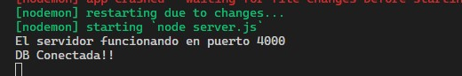

### Proyecto: Gestor de proyectos/tareas

- Este repositorio es sólo el backend de este proyecto.
- El repo del frontend lo encontrarás aquí:  
[https://github.com/gabyballester/front-projects-tasks-react-hooks-context](https://github.com/gabyballester/front-projects-tasks-react-hooks-context)

***
### Preparación
#### Instalar dependencias
```
yarn install
```

#### Variables de entorno
Renombra `.env.example` a `.env` y configura las variables

#### Arranque
```
yarn dev
```

#### Url y puerto
http://localhost:4000/

***
### Captura del arranque del proyecto


